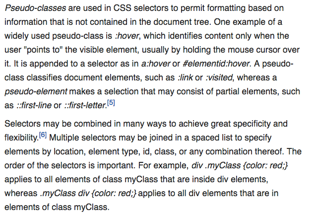

# Оформление строчных блоков кода

#Practical #Design #CSS

Когда я работал над [новой версией моего сайта]({}), я пытался побольше думать о том, как всё будет выглядеть и читаться с точки зрения типографики. Одной из вещей, с которыми у меня всегда были проблемы — как оформлять строчные блоки кода. Чаще всего, на их месте мы видим маленькие разноцветные прямоугольники. И чем больше ими набиваешь текст, тем хуже становится его читабельность.

. Поглядите на все эти разноцветные прямоугольники. Кроме того, заметьте, что в тексте есть несколько мест, которые можно было бы разметить строчными блоками кода. Возможно, это не было сделано как раз из-за того, что текст стал бы ещё сильнее захламлён.")

Что, если это слишком часто используемое оформление строчных блоков кода — излишне?

Практически всё, что мы видим, приходит от полноценных многострочных блоков кода. Но точно ли нам нужны все эти стили в строчном контексте?

**Нужен ли нам моноширинный шрифт?** Неа. Моноширинность полезна тогда, когда у нас есть несколько строк, внутри которых нам нужно выравнивать символы друг относительно друга определённым образом. Но вот внутри обычного текста? Нам это не нужно. Уходи, моноширинный шрифт.

**Нужны ли нам какие-то бордеры или цвет фона?** Вряд ли. На больших блоках кода они выглядят нормально, но в строчном контексте подобное оформление очень сильно выпячивает наши строчные блоки, делая их слишком **жирными**. А это, в свою очередь, ухудшает читаемость текста, так как глаз начинает спотыкаться, обращать внимание на эти яркие пятна ещё до того, как мы дочитаем до нужно места.

**Нужна ли нам подсветка синтаксиса?** Сомневаюсь. Она полезна тогда, когда у нас есть много кода, и нам нужно отделить одни конструкции в нём от других. А вот в строчном контексте, когда в блоках кода оказываются лишь одно-два слова, подсветка становится излишней и ничего нам не даёт кроме ненужного привлечения внимания.


## Моё решение

Итак, если все эти стили лишние, а то и вредные для нашего текста, что нам использовать вместо них? После обдумывания всех этих моментов, я решил вспомнить о том, как же оформляют похожие сущности в обычных книгах. И, оказывается, что когда доходит дело до ненавязчивого выделения небольших фрагментов текста, решение очевидно. _Курсив_. И если он подходит для большинства обычных текстов, то почему бы не использовать курсив и для оформления строчных блоков кода?



Собственно, можно посмотреть на строчный блок кода прямо в этом тексте[^semantics]: _font-style: italic_. На мой взгляд, выглядит вполне неплохо — ненавязчиво, но явно отделено от основного текста.

[^semantics]: Прямо тут я использовал `<em>`, так как этот текст может оказаться, например, в RSS-читалке, то есть там, где вы, скорее всего, не увидите стилей, специфичных для моего блога.

Курсив достаточно отделяет код от остального текста, в большинстве случаев можно вообще больше ничего не добавлять. Самый простой способ сделать такие блоки кода курсивными следующий:

``` Stylus
:not(pre) > code {
    font: inherit;
    font-style: italic;
}
```

Этим мы сделаем наши стандартные моноширинные блоки кода стандартным курсовом. Обратите внимание на `:not(pre)` — если размечать полноценные блоки кода с помощью `<pre><code>`, этот селектор к ним не применится. Конечно, если мы используем какую-то подсветку синтаксиса, нам надо будет её отключить для строчных блоков кода (или переопределить её стили). В некоторых случаях, когда вы используете отдельный шрифт для курсивного начертания, а в нашем веб-шрифте его нет, нам надо будет не забыть указать отдельны веб-шрифт и для наших блоков кода, иначе мы получим псевдокурсив.


## Да, это всё субъективно

Курсив для строчных блоков текста, конечно, может быть непривычен. Я и не говорю, что это единственный правильный вариант. Можно сказать, что это дело стиля — как вы будете оформлять строчные блоки кода. Иногда вы можете и захотеть, чтобы они выпячивались и привлекали внимание. Но, если вам захочется добавить читаемости вашим испещрённым строчными блоками кода текстам, — курсив вам в этом поможет.
